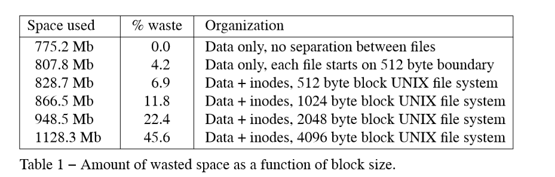
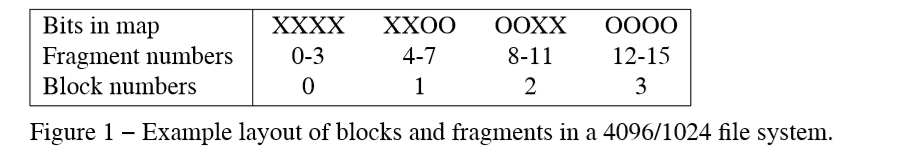

# paper reading 
## Introduction

original UNIX has simple and elegant file system:
- i/o is buffered by kernel
- no alignment constraints on data transfers
- all operations are synchronous 
- transfer 512 byte blocks, be placed arbitrarily
- no constraints other than disk space on file growth

> When used on the VAX-11 together with other UNIX enhancements, the original 512 byte UNIX file system is incapable of providing the data throughput rates that many applications require.

> This requires a file system providing higher bandwidth than the original 512 byte UNIX one that provides only about two percent of the maximum disk bandwidth or  about 20 kilobytes per second per arm.

Developer retained the abstraction and imply changed the underlying implementation to increase its throughput

## Old File System
Old fs feature:

- divide disk into *sectors*
- a sector may contain one fs
- directories are some special file, containing pointer to files
- each file has descriptor called *inode*
- inode contain ownership and timestamp about last modify and access
- inode has block, indirect block, double indirect block, triply indirect block
- 150M old fs consists of 4M  inode and 146M data
- never transfers more than 512 bytes per disk transaction
- often finds that the next sequential data block is not on the same cylinder
-  pointer to the free list, a linked list of all the free blocks in the file system

Attempt to improve reliability and throughput:

- **reliability**: staging modifications to critical file system information
- **performance**: factor of more than two by changing the basic block size from 512 to 1024 bytes
    - each disk transfer accessed twice as much data
    - most files could be described without need to access indirect blocks since the direct blocks contained twice as much data

 file system with these changes will henceforth be referred to as the *old file system*

 Because free list will became scrambled as files were created and removed, it made old fs deteriorated from 175 KB/s to 30KB/s after a few weeks of moderate use.
 
 Eventually the free list became entirely random, causing files to have their blocks allocated randomly over the disk. 

 ## New file system organization

 New fs feature:
- each disk contains one or more fs
- The size of file system blocks can be any power of two greater than or equal to 4096.
- divides disk partition into one or more *cylinder groups*
- cylinder group associated with  a redundant copy of the super-block, space for inodes, a bit map describing available blocks
- bookkeeping information was placed at varying offset from beginning of the cylinder group.

### Optimizing storage utilization

***large block size improve speed but waste space***

To be able to use large blocks without undue waste, small, files must be stored in a more efficient way:
- allowing the division of a single file system block into one or more fragments
- The lower bound on the size of these fragments is constrained by the disk sector size, typically 512 bytes
- The block map associated with each cylinder group records the space available in a cylinder group at the fragment level; to determine if a block is available

----
write with fragments setting:
- There is enough space left in an already allocated block or fragment to hold the new data. The new data is written into the available space. 
- File contain no fragment, just write in new blocks, remaining will place in fragments or a new blocks.
- File contain fragments. If the size of the new data plus the size of the data already in the fragments exceeds the size of a full block, a new block is allocated. The contents of the fragments are copied to the beginning of the block and the remainder of the block is filled with new data.  Otherwise, if the new data to be written will fit in less than a full block, a block with the necessary fragments is located, otherwise a full block is located. The contents of the existing fragments appended with the new data are written into the allocated space. 

----
Since file systems with different block sizes may reside on the same system, the file system interface has been extended to provide application programs the optimal size for a read or write. 
- For files the optimal size is the block size of the file system on which the file is being accessed.
- For other objects, such as pipes and sockets, the optimal size is the underlying buffer size.

>The new file system uses less space than the 512 byte or 1024 byte file systems for indexing information for large files and the same amount of space for small files. These savings are offset by the need to use more space for keeping track of available free blocks. The net result is about the same disk utilization when a new file system’s fragment size equals an old file system’s block size.  

new fs have the minimum acceptable level of free blocks, once it drops down that, only administrator could allocate new blocks.

Once it runs out, the throughput tends to be cun in half, because of the inability of the file system to localize blocks in a file

### File system parameterization

> A goal of the new file system is to parameterize the processor capabilities and mass storage characteristics so that blocks can be allocated in an optimum configuration dependent way.

Physical characteristics:
- processor: expected time to service an interrupt and schedule a new disk transfer
- disk:  the number of blocks per track and the rate at which the disk spins
- 
>Given a block allocated to a file, the allocation routines calculate the number of blocks to skip over so that the next block in the file will come into position under the disk head in the expected amount of time that it takes to start a new disk transfer operation. 

----
> Eight rotational positions are distinguished, so the resolution of the summary information is 2 milliseconds for a typical 3600 revolution per minute drive. The super-block contains a vector of lists called rotational layout tables. The vector is indexed by rotational position. 

to be continued.

### Layout Policies

  

