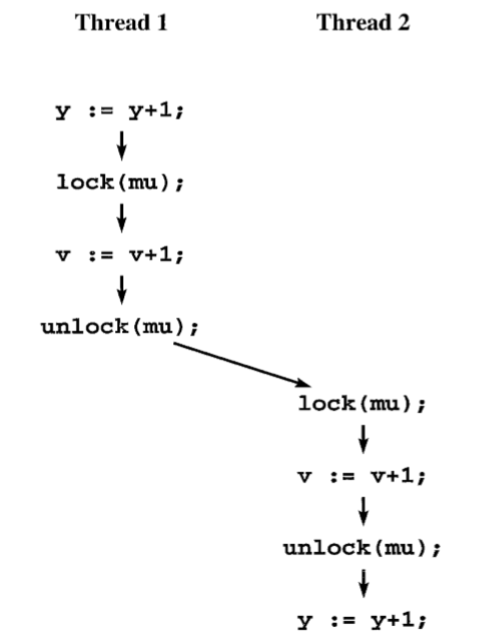
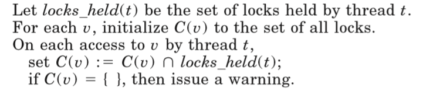
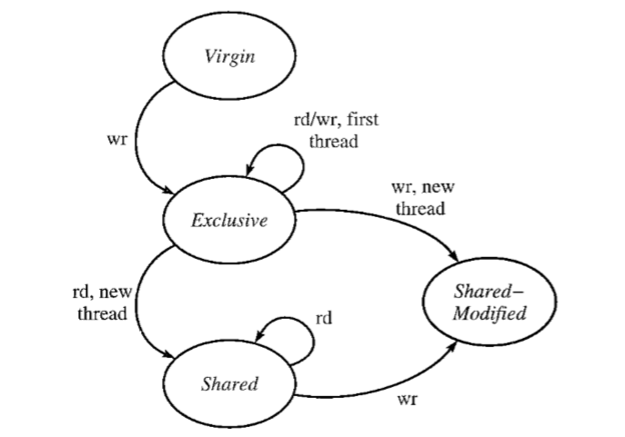
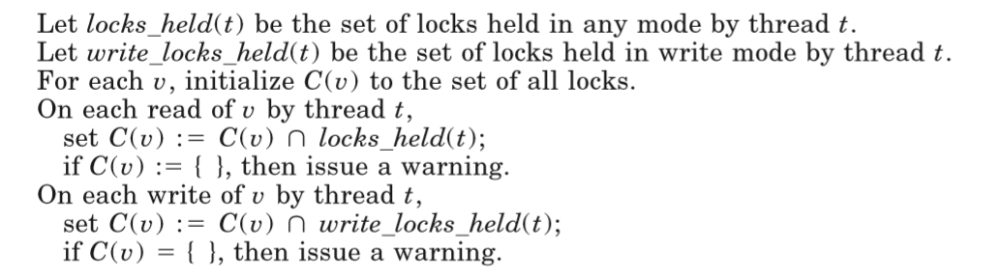
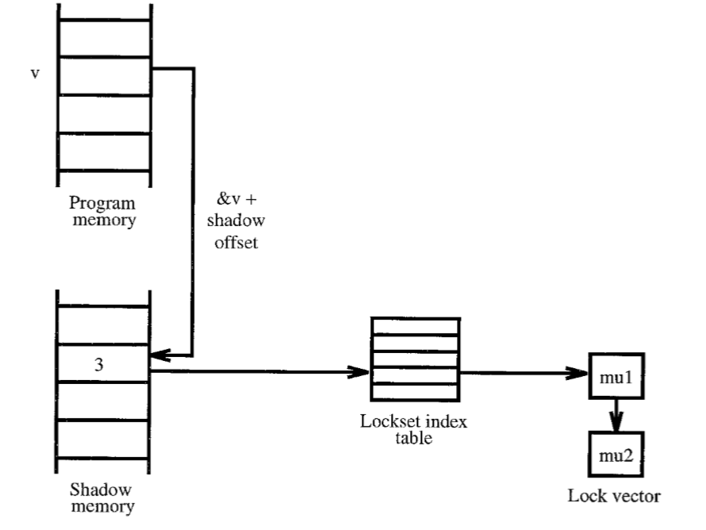
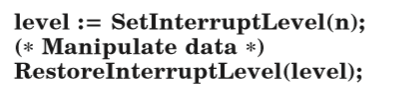

# Eraser——一种面向多线程程序的数据竞争动态监测器

## 简介

现在许多程序都采用多线程，但是多线程程序编程和调试都很困难。一些很简单的同步错误由于其竞争的时间依赖而导致需要几周甚至几个月才能追踪出来。

之前的动态竞争检测工具基于Lamport的*happens-before*关系，检查来自不同线程的冲突内存访问是否由同步事件分隔开（比如通过锁来分隔开不同线程对同一内存的访问）。

Eraser是特别针对在现代多线程程序中基于锁的同步机制而开发的。Eraser简单的检查所有的共享内存访问是否遵循一致的**锁原则**。**锁原则**是一种保证不存在数据竞争的编程方法。

### 定义

数据竞争发生在两个并发线程访问共享变量时：
- 至少有一个访问是写入
- 写入线程没有采用显式机制阻止同时访问

### 相关工作

一个比较早的阻止数据竞争的尝试是由Hoare率先引入的监视器的概念。

监视器是一系列被过程包装起来的共享变量，这些变量被封装在对应的过程中，只能通过对应过程访问，每个变量都绑定一把匿名锁，在进入和退出过程时自动获取与释放。通过这样的方式，监视器提供了静态的、编译时的对共享变量的保护，使得对他们的访问被串行化以此来防止数据竞争。但这样的方式不能保护动态申请的共享变量。

----

在动态竞争探测领域的大部分早先工作都是在科学并行编程社区（scientific parallel programming community）进行的，并且是基于Lamport的*happens-before*关系。

*happens-before* 次序是所有线程的所有事件的并发执行中的一部分次序。单线程下，事件被排序为他们发生的顺序；多线程下，事件依据他们访问的同步对象的属性而排序。当同步对象禁止在时间上对两次交互的调度时，一个线程先访问同步对象，另一个线程后访问同步对象，第一次访问被定义为*happen before*第二次访问。

如果两个线程对共享变量的方位没有以*happens-before*排序，那么在其他的可能情况下，这两次访问就很有可能同时发生，这意味着数据竞争也有可能发生。所有我们知道的早先的动态竞争探测工具都是基于这个观察的，这些竞争探测器监控每一个数据引用和同步操作，并且检查是否有对在特定执行顺序下与*happens-before*关系无关的被监控共享变量的冲突访问。

但是这样的工具有两个确定：
- 难以实现。因为这需要每个线程对于每个共享内存区域的并发访问信息。
- 效率不高。基于*happens-before*的工具的效率严重依赖于调度程序所产生的交错。

如上图所示，基于*happens-before*的方法会遗漏这个数据竞争，尽管对于`y`的访问没有被保护，但是因为`Thread 1`在`Thread 2`之前持有一把锁，所以`Thread 2`对`y`的访问在这种交错之下被认为是*happens-before*。一个基于*happens-before*的工具当且仅当调度器产生一个`Thread 2`的这段代码在`Thread1`之前的交错才有可能探测到这个错误。因此，探测器需要大量的测试用例去测试尽可能多的交错。

但对于Eraser来说，任何测试用例都能探测到这个错误，因为存在两条代码路径违反了对`y`的**锁原则**而不需要在意调度器生成的交错。

----

Dinning 与 Schonberg 的 *lock covers*是对*happens-before*的一个提升。

## LOCKSET算法

首先最简单的版本就是强制执行一个最简单的**锁原则**————每个共享变量都必须被某个锁保护，也就是说，任何线程访问这个变量时，都必须持有锁。由于Eraser无法知道哪把锁是保护哪个变量的，所以它必须从执行历史推断。

对每个共享变量v，Eraser维护一个v的侯选锁集合C(v)。这个集合包含了那些至今为止保护v的锁，也就是说，如果锁l在C(v)中，那么到目前的计算为止，每个线程访问v时都持有锁l。当v初始化的时候，C(v)是所有可能的锁，每次v被访问，Eraser用C(v)和当前持有的锁的交集更新C(v)。这个过程被称为*lockset refinement*，确保任何不断保护v的锁都在C(v)中，如果C(v)为空，那就说明没有锁保护v。

算法伪代码如下

### 改进锁原则

简单的**锁原则**太严格了，这里有三种非常常见的编程实践违反了这一原则，但是却不会引发数据竞争。
- 初始化：共享变量经常被初始化但却无需持锁。
- 共同读取数据：一些共享变量旨在初始化时被写入，之后就只是只读的，无锁访问也是安全的。
- 读写锁：读写锁允许多个`reader`读取共享变量，但只允许一个`writer`写。

### 初始化和共同读取

对于一个线程而言，没有必要锁住其他的无法持有正在被访问的改变量的引用的线程。这一特性经常在初始化新申请的数据时被使用。为了避免假警报，Eraser推迟了*lockset refinement*直到数据被初始化完毕。由于无法得知何时初始化结束，Eraser将该数据第一次被其他线程访问认为为初始化结束。

由于被多个线程同时读取不存在竞争，所以不需保护一个只读变量。为了支持对特定变量无需锁的共同读取，Eraser只在一个初始化了的变量在被多个线程共同写时报错。

下图图示了控制的状态转换。

- Virgin：当共享变量被申请。
- Exclusive：当该变量在单个线程中被读写，这代表初始化。
- Shared：当该变量被其他线程读取，在这一状态，C(v)会被更新，但不会报告竞争。
- 当该变量被其他线程写入时，在这一状态，C(v)会被更新，同时也会报告race。

对初始化的支持使得Eraser的检查更加依赖于调度器了。假设一个线程不持锁地申请和初始化一个共享变量，并且错误的使得第二个线程可以访问该变量，那么Eraser只有在第二个线程恰好在初始化完成前访问才能探测到这一竞争。

### 读写锁

为了适应一个`writer`多个`reader`的情况，Eraser引入了最后一个优化：对每个变量v，锁m保护v意味着对于所有写入，m被以写模式持有；对于所有读取，m被写或读模式持有。

只需更新Figure 4的Shard-Modified状态即可。下图为代码。

## 实现ERASER

Eraser以未修改的二进制程序为输入，自动加入指令生成功能完全相同的二进制程序，但包含了Eraser的运行时调用以实现*Lockset*算法。

Eraser追踪堆和全局变量，但不追踪栈指针的间接引用。Eraser追踪除了栈指针以外的寄存器，以及保存栈变量的寄存器，这并非出于允许共享栈变量，只是因为实现的原因。

Eraser侦测到竞争是，会追踪到源文件的行号，也会列出栈轨迹、线程ID、内存地址、内存访问类型和重要的寄存器信息例如PC、栈指针。

### 表达候选锁集

由于锁的数量很少，所以采用一个小整数来表达一组锁，一个表中的锁集索引映射到一个排序后的锁地址向量中。表中的每个条目都不会被释放或者修改。

新的锁集索引通过锁的释放、获取或交集操作的应用程序创建。为了确保每个锁集索引代表一个不同集合的锁，Eraser采用hashtable，并且缓存每个交集操作的结果，所以一个集合交操作的快速情况是一次表查询，由于向量是被排序的，所以一次集合交操作的缓慢情况是一次向量比较。

每个在数据段和堆中的32-bit的单词都有一个影子单词，包含30-bit的锁集索引和2-bit的状态条件。Exclusive状态30-bit存储线程id。

当线程访问内存时，Eraser通过添加固定的替换来找到影子单词。如下图所示

### 性能

应用程序使用Eraser会慢10到30倍。这会改变线程调度，但是从经验看，影响不大。但开发者没有对于极端时间敏感型应用的经验。

开发者估计有一半的减慢都是由于在每个`load`和`store`的过程调用。

### 程序注解

Eraser也会发出假警报。经验上，假警报主要有以下三种
- 内存复用：如果内存被复用却没有重置影子内存，那么会导致假警报。许多程序自己实现的自由列表或私有分配器，Eraser无法得知被私自回收的内存应被一个新锁集保护。
- 私锁：由于锁被使用却不与Eraser沟通，假警报也会触发。这通常由于自己实现了而非标准pthread接口的一部分的锁。
- 良性竞争：确实是数据竞争但却不影响程序正确性。一些是故意的，一些是意外的。

对于每种假警报，Eraser有相应的注解来允许使用者消除这些假警报。

### 系统内核的竞争探测

修改Eraser以使得其能探测*SPIN*系统的竞争。*SPIN*系统有一系列特性，比如，运行时代码生成、后期代码绑定、使插装过程复杂化，因此Eraser在这个环境下不能使用。

首先*SPIN*会提升处理器中断水平来为被设备驱动和其他中断级别代码访问的共享数据结构提供互斥，中断水平会导致低于这个水平的中断无效。
提升然后恢复中断水平可以代替锁，如下列代码。

但是一个特定中断水平会保护所有低于这个中断水平的数据结构。通过将给每个单独的中断水平一个锁的形式，使Eraser能够处理这样的不同，当内核设定中断水平为n时，Eraser认为前n个锁全部被获得了。

另一个不同是，操作系统经常使用post/wait风格的同步机制，最常见的就是使用信号量来同步线程和I/O设备。这会造成问题，因为信号量没有所有权概念。

## 经验

使用Eraser在来自Altavista的HTTP服务器和索引引擎、Vesta缓存服务器、Petal分布式存储系统、以及华盛顿大学的学生的家庭作业上做了测试。
Eraser在服务器上运行良好表明，有经验的程序员倾向于遵守简单的锁原则，哪怕是在一个提供了许多精心设计的同步原语的环境下。

### AltaVista

测试了AltaVista Web indexing service的两个组件：mhttpd、Ni2。

其中有许多被故意设计的竞争，也有一些因为影响不大从而没有考虑优化的竞争条件。

### Vesta Cache Server

主要报告了关于三种数据结构的竞争，第一种是缓存条目的指纹，第二种是CacheS对象中的自由列表，第三种是由于事先服务器端的RPCs的TCP_sock和SRPC对象。

### Petal

用Eraser探测到了由于自己实现的读写锁而引发的假警报，由于例程 GMapCh CheckServerThread()引发的真实竞争，两个由于不使用锁的包含统计数据的全局变量而引发的竞争。最后，Eraser还发现了一个无法被注解的假警报，是由于内存复用引起的。

### 学生作业

10%存在竞争，主要由于忘记拿锁、写入拿锁而读取不拿锁、使用不同的锁保护一个数据结构、忘记在循环中重新获取锁。

也存在由于访问被隐式保护的列表元素而发出的假警报。

### 效率和敏感性

由于Eraser使用测试方法，所以无法保证程序不存在竞争。同时Eraser的测试并不对调度器的交错特别敏感。

在重新引入Ni2历史中存在的两个竞争后，使用Eraser在几分钟内就定位到了竞争，并在30分钟内解决了，核实了没有进一步的竞争报告，这样的竞争原本花了几个月来找到并由程序作者修复。

在使用双线程和十线程进行测试时，Eraser给出了相同的竞争报告，这说明Eraser对线程交错不敏感。

## 附加经验

还存在两个问题需要解决，一个是多重锁的问题，一个是死锁的问题。

多重锁可以通过拓展锁集算法到锁集-集算法来解决，但这样得不偿失。多重锁类似读写锁问题，通过修改锁集算法为只在写入时更新锁集，但这样会导致只有在写入提前于读取时才会报告错误。

死锁是另一个比较复杂的问题，可以通过让获取锁的顺序满足一个规则来避免。开发者检测了formsedit，一个大型的Trestle应用，但是并没有发现锁的获取存在某种规则。

## 总结

硬件工程师为了可测试性而设计，程序员也应该为了可测试性而使用线程，所以应当使用简单的锁原则而不是复杂的同步机制。